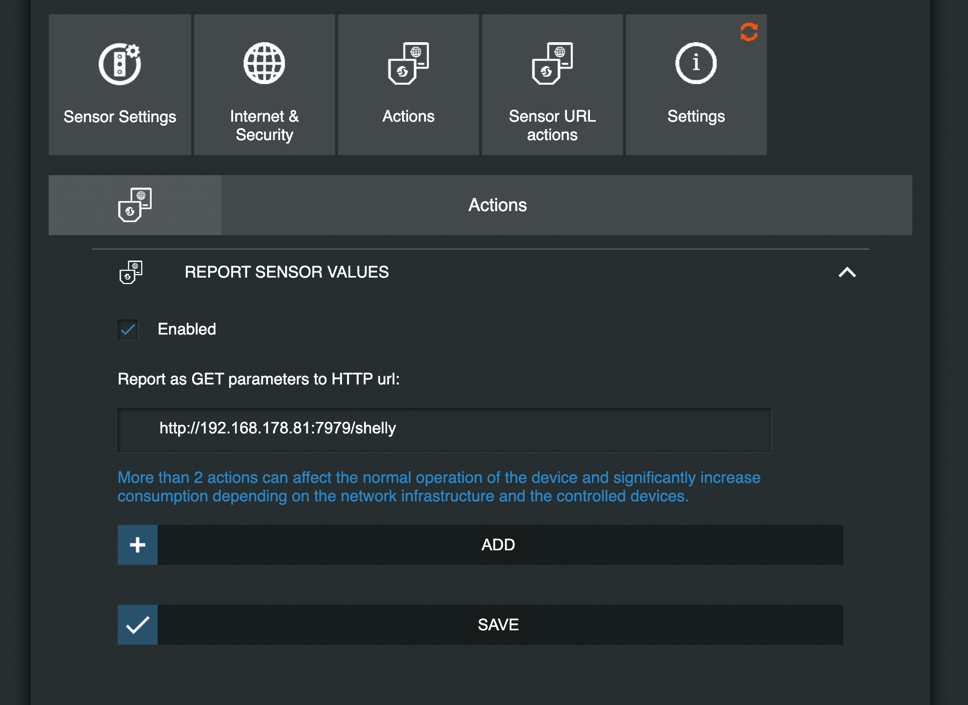

# home-metric-exporter

This exporter collects sensor data from Deconz and Shelly devices and exposes them as Prometheus metrics.

Supported devices are currently:
- All light zigbee light bulbs connected to Deconz
- Shelly HT
- Shelly Plug
- Shelly Plug S

The use case of the exporter is to collect and store the data of the devices in order to visualize them or create alerting.

## Setup & Deployment

### Getting Credentials

#### Deconz

The exporter calls the Deconz API. In order to do this, you must generate an API key like so.

```shell
curl -X POST -H "Content-Type: text/plain" --data '{"devicetype":"home-metric-exporter"}' http://192.168.178.77:80/api
```

Be sure to allow new connections through the Deconz UI.

Add the API key to the docker-compose.yml file or environment variables.

#### Shelly

Authentication works with basic auth. All Shelly devices must be secured with the same username and password.
Add the values to the docker-compose.yml file or environment variables.

##### Shelly HT

All Shelly HT devices must be secured with the same username and password.
In the Web UI of each device, add an Action to report the sensor data to your exporter instance:
```shell
HOST_IP:7979/shelly
```


##### Shelly Plug

Works out of the box.

#### Deployment

The exporter is intended to run as a Docker container. Executing the Go binary directly is also possible.

##### Docker

Fill the required environment variables in the docker-compose.yml file and run:

```shell
docker-compose up -d
```

### Mappings

Shelly devices don't contain information on their location. Therefore, it's possible to create a mapping file in the
`mappings/` directory. See the `shelly-example.json` file for an example.
The fields are:

```go
type ShellyMapping struct {
	DeviceId   string 
	DeviceType string 
	Room       string 
	Ip         string 
	DeviceName string
}
```

### Collecting the metrics with Prometheus

This exporter exposes the metrics at http://HOST_IP:7979/metrics. Deploy a Prometheus instance and add the following to the prometheus.yml file:

```yaml
scrape_configs:
  - job_name: 'home-metric-exporter'
    scrape_interval: 5s
    static_configs:
      - targets: ['HOST_IP:7979']
```

In case you are running prometheus on an older arm/v6 device, see github.com/oppermax/prometheus-docker-armv6.
